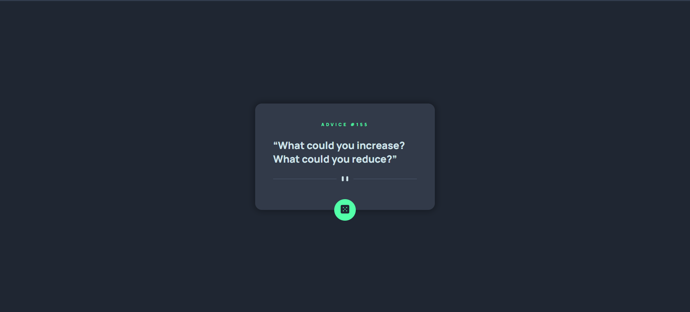

# Frontend Mentor - Advice generator app solution

This is a solution to the [Advice generator app challenge on Frontend Mentor](https://www.frontendmentor.io/challenges/advice-generator-app-QdUG-13db). Frontend Mentor challenges help you improve your coding skills by building realistic projects.

## Table of contents

-   [Overview](#overview)
    -   [The challenge](#the-challenge)
    -   [Screenshot](#screenshot)
    -   [Links](#links)
-   [My process](#my-process)
    -   [Built with](#built-with)
    -   [What I learned](#what-i-learned)
-   [Author](#author)

**Note: Delete this note and update the table of contents based on what sections you keep.**

## Overview

### The challenge

Users should be able to:

-   View the optimal layout for the app depending on their device's screen size
-   See hover states for all interactive elements on the page
-   Generate a new piece of advice by clicking the dice icon

### Screenshot



### Links

-   Live Site URL: [Add live site URL here](https://xondamir-coder.github.io/advice-generator/)

## My process

### Built with

-   Semantic HTML5 markup
-   CSS custom properties

### What I learned

Got better at using fetch I guess

```js
const proudOfThisFunc = () => {
	const URL = 'https://api.adviceslip.com/advice';
	try {
		const res = await fetch(URL);
		const data = await res.json();
		const advice = data.slip.advice;
		const id = data.slip.id;

		modalText.textContent = `“${advice}”`;
		modalNumber.textContent = `advice #${id}`;

		[modalText, modalNumber].forEach(el => el.classList.remove('blurred'));
	} catch (error) {
		console.error(error);
	}
};
```

## Author

-   LinkedIn - [Xondamir](https://www.linkedin.com/in/xondamir-nazrullayev/)
-   Frontend Mentor - [@Xondamir-coder](https://www.frontendmentor.io/profile/Xondamir-coder)
